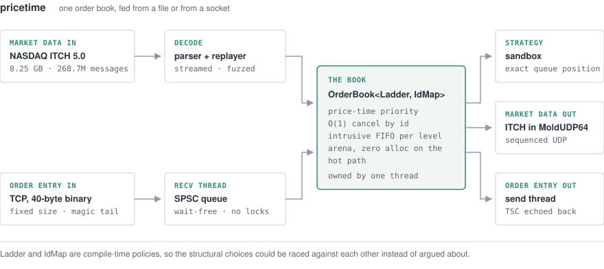
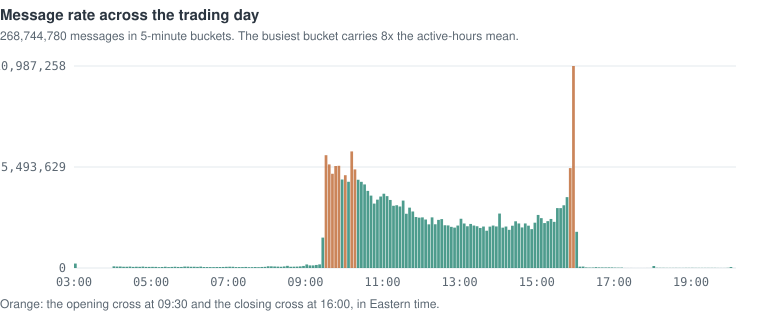
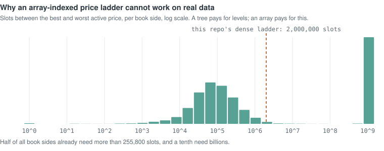
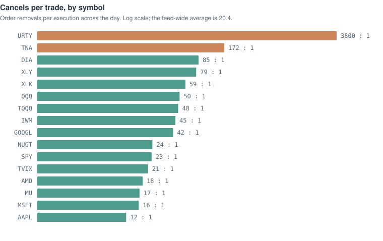
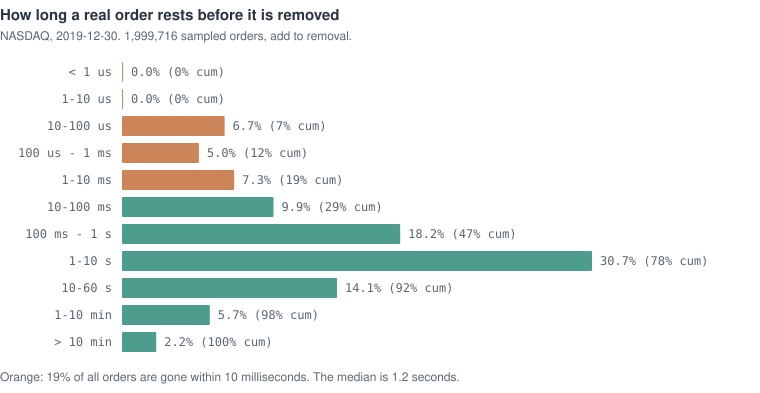

# pricetime

A limit order book, matching engine, NASDAQ ITCH 5.0 replay pipeline, and
market-making sandbox in C++20. The book and the replay path are validated
against a real full trading day of NASDAQ market data: 268,744,780 messages
across 8,892 symbols.

[](https://github.com/anish-agr/pricetime/actions/workflows/ci.yml)




## Numbers

1M samples per scenario, exact percentiles from full sorted sample sets,
`LFENCE`-serialized TSC timestamps, timer overhead (13 ns) included rather
than subtracted:

| path | p50 | p99 | p99.9 | throughput |
|---|---|---|---|---|
| book: add (steady state, ~100k resting orders) | 182 ns | 322 ns | 518 ns | 3.7 M ops/s |
| book: cancel (steady state) | 292 ns | 527 ns | 1.08 µs | 3.7 M ops/s |
| book: execute (aggressive add, one fill) | 231 ns | 419 ns | 637 ns | 3.6 M ops/s |
| ITCH replay: full-day book build, real NASDAQ data, all 8,892 symbols | — | — | — | 0.45 M msg/s‡ |
| ITCH replay: parse + route, symbol-filtered (same real day) | — | — | — | 6.6–7.5 M msg/s |
| engine, wire-to-wire (TCP→match→TCP, loopback, busy-poll) | 13 µs | 51 µs | ~800 µs† | — |
| engine, pipelined order flow | — | — | — | 1.77 M req/s in / 2.46 M resp/s out |

Machine: Intel Core Ultra 5 225U laptop (2 P-cores + 8 E-cores), Windows 11,
MSVC `/O2`, pinned P-core, on AC power. A laptop is not a tuned server, so the
relative comparisons are the result and the absolute numbers are a floor.

† The wire-to-wire tail is core starvation. Busy-polling needs a core budget
this chip does not have; blocking sockets trade the median (34 µs p50) for a
much tighter tail (72 µs p99). Both modes ship.
‡ Working-set-bound rather than parse-bound: roughly 8 GB of live books plus
the 8.25 GB file streaming through 15.5 GB of RAM. The filtered row is the
same parser with the same code path when memory fits.

## Real NASDAQ data

The pipeline replays NASDAQ's published TotalView-ITCH file for December 30,
2019: 8.25 GB, 268,744,780 messages, 8,892 symbols.

- Clean parse with zero unknown order references. Every execute, cancel,
  delete, and replace across the day resolved to a live order, which means the
  decoder offsets are byte-exact; a single wrong byte produces garbage
  references within seconds.
- No crossed books, and share conservation
  (`added = executed + canceled + resting`) holds in all 8,892 books.
- Busiest minute of the day: 3.7 M messages during the 16:00 closing auction,
  19.9× the day's mean.
- The market-making sandbox runs against the real AAPL flow (see finding 6).

The unedited output of these runs is in [docs/runs/](docs/runs/), with the
command that produced each one.



## Findings

Nine results from measuring design choices instead of assuming them. Three of
them contradicted what this repo believed before the measurement, including one
of its own published claims.

**1. The id map matters more than the price ladder.** With everything else
held constant, swapping the ladder moves medians by a few percent. Swapping
`std::unordered_map` for an open-addressing id map (linear probing,
backward-shift deletion, no tombstones) moves cancel p50 by 2.1×, execute by
2.8×, and the p99.9 add tail by 21×, because rehash pauses land on individual
operations. Cancels outnumber trades 20:1 on the measured day (finding 8), so
the id map is the hot path.

**2. The dense ladder's worst case is 1400×.** Empty the best level while the
next active level is far away and the array rescans the gap: 81 µs against the
tree's 57 ns. The scenario is adversarial, and it is in the benchmark table.

**3. Microbenchmarks, profiles, and end-to-end runs disagree.** Microbenchmarks
put the two ladders within noise. gprof over a full replay attributes 26% of
runtime to tree node churn (1.47 M level creations, 722 k destructions), which
steady-state microbenchmarks cannot see because they keep levels alive. End to
end the tree still wins, since a feed-safe dense ladder costs ~160 MB per
symbol and the resulting TLB pressure outweighs the churn it avoids. A third
ladder recycles its tree nodes through C++17 node handles (extract, re-key,
splice; zero allocator traffic after warmup, enforced by test) and is the
fastest of the three on the real day: 0.45 against 0.40 M msg/s.
([docs/PROFILE.md](docs/PROFILE.md))

**4. Busy-polling halves the median and can wreck the tail.** Blocking sockets
spend about 20 µs per round trip in scheduler wakeups. Spinning recovers that
(34 → 13 µs p50) and multiplies p99.9 by 40 when four hot threads share two
P-cores. Separately, one syscall per 40-byte message capped throughput at
30 k req/s; coalescing sends and buffering receives raised it 59× and left
ping-pong p50 unchanged.

**5. Queue position changes backtest fills by 5.5× on real data.** The exact
model places the simulated order behind every order already resting at its
price (ITCH identifies each one) and fills it only once the feed shows them
gone. On real AAPL flow the optimistic any-print-fills-us model reports 24,145
fills and the queue model 4,391. On a synthetic day quoted inside the spread
the same gap is four orders of magnitude, 86,153 against 6. Quoting off the
instrument's tick grid produced sub-penny prices that cannot rest in AAPL's
book at all: the queue model returned zero fills for the whole day while the
optimistic model reported 43,827.

**6. Spread capture is not profit.** Quoting AAPL at the touch all day: 4,391
fills, +130 ticks per share of spread captured, and a net loss of $1,317. The
mid moves 136 ticks against each fill within 1 ms and 182 ticks by 1 s. That
markout curve is what adverse selection looks like in the accounting, and it
is the number a market-making backtest exists to produce.

**7. Level count and price span differ by a factor of 4,800, and the array
ladder loses on the second one.** The median book holds just 53 active
price levels, which sounds like an array would be cheap. Those levels are
spread across 255,800 ticks. A tree pays for the levels that exist; an array
indexed by price offset pays for the distance between the furthest apart of
them. At 40 bytes per slot the median book needs 10 MB per side and the p90
book needs 80 GB, because far-out resting quotes stretch the span to nearly
the whole representable price range (the widest, `SHIPW`, spans 2.0 billion
ticks, about $200,000). This closes the open question the profiling raised: a
windowed dense ladder is not a small fix to the array, it is a different data
structure.



**8. Cancels beat trades 20:1, and 98.5% of posted shares never trade.** This
one corrected the repo's own README, which had claimed 10:1 from folklore.
Measured over the day: 118.6 M adds, 114.4 M deletes, 21.6 M replaces, and only
5.8 M executions. Executions are **2.2%** of all book events, not the ~10% the
design notes assumed. Only **1.49%** of all posted shares ever traded. The
dispersion between symbols is larger than the average: `NIO` removes 4.8 orders
per execution, `QQQ` 50, and `URTY` 3,800.



**9. Most orders die in milliseconds; the median lives a second.** 19% of orders
are removed within 10 ms and 6.7% within 100 µs, while the median lifetime is
1.2 s and the mean is dragged to minutes by resting interest that never moves.
The queue you join is also shorter than intuition suggests: the median best
level holds a single order, and the p99 holds 16.



These three come from `book_stats`, which walks the day and reports the
distributions rather than the totals. Its full output is in
[docs/runs/real-day-statistics.txt](docs/runs/real-day-statistics.txt), and the
charts above regenerate from it with `python tools/plot_stats.py`.

## Components

- **The book.** Price-time priority matching (limit, IOC, FOK, market), O(1)
  cancel by id, intrusive per-level FIFO queues, a chunked arena with an
  intrusive free list, and two structural policies (`Ladder`, `IdMap`)
  swappable at compile time so they can be raced against each other.
- **Self-trade prevention.** Cancel-resting, cancel-aggressor, or cancel-both,
  applied when an order would match another from the same participant. The
  participant id sits in padding the `Order` struct already had, so the feature
  costs zero bytes per order and a static assertion keeps it that way.
  Fill-or-kill takes it into account: its pre-scan walks orders rather than
  levels when prevention is active, because promising all-or-nothing and then
  stopping halfway is the one outcome that order type forbids. Measured cost
  of having it compiled in and enabled but not firing: 181.0 to 182.3 ns p50
  on a one-fill execute, which is inside run-to-run noise
  ([the run](docs/runs/self-trade-benchmark.txt)).
- **ITCH 5.0.** Big-endian decoders, a framed BinaryFILE reader, a separately
  written encoder so round-trip agreement is evidence about the spec rather
  than two copies of one misreading, and multi-symbol reconstruction through a
  global order-to-book index. Reconstruction is not matching: the exchange
  already matched, so feed adds rest passively and conservation becomes
  `added = executed + canceled + resting`, one side per trade instead of two.
- **The engine.** recv → match → send plus a market-data thread, joined only
  by wait-free SPSC queues, with the book owned by a single thread and no lock
  guarding it. Order entry is a 40-byte fixed binary protocol with a magic
  tail, so a desynchronized stream fails at the first message. Market data
  leaves as real ITCH 5.0 inside MoldUDP64 (sequenced UDP, heartbeats,
  end-of-session), and a book rebuilt from that stream alone must hash
  identically to the engine's own. TSC stamps echo through every response, so
  wire-to-wire latency needs no clock synchronization.
- **The sandbox.** An inventory-skewed quoter, integer tick accounting
  (doubles lose cents across 100 k fills), mid-based marking, markout curves at
  1 ms to 1 s horizons, and the queue-position fill model above.
- **Microstructure statistics.** `book_stats` reports the distributions behind
  findings 7 to 9: active levels and price span per book, order lifetime,
  order size, and cancel-to-trade by symbol. Level counts are sampled and
  lifetimes follow one order in 64, both stated in the output, because holding
  a timestamp for every live order would add gigabytes to a run that is already
  working-set-bound.

## Testing

183 test cases / 7.36 M assertions, run on GCC 15 and MSVC with warnings as
errors, plus ASan/UBSan, TSan, and libFuzzer jobs in CI.

- **Differential testing against an independent model.** A naive O(n)
  reference book (flat vector, linear scans, no shared code with the real
  implementation) must agree with every policy combination operation for
  operation: result codes, execution stream, and state fingerprint. Comparing
  two fast implementations shares the matching loop and therefore its bugs.
- **Golden replay.** A seeded 100 k-operation stream hashes to a pinned
  constant on every platform, compiler, and policy. The id map was replaced,
  the pool rewritten, and four order types added without the constant moving.
- **Deterministic performance tests.** CI timings are noise, so CI asserts
  allocations instead: global `operator new` is replaced and counted, and a
  warmed book must run 200 k mixed operations with zero heap calls. This
  caught the free list itself allocating.
- **Mutation-tested concurrency.** The SPSC queue passes TSan, and relaxing
  its release/acquire pairing makes TSan fail at the predicted line, which is
  what makes the green run meaningful.
- **Feed integrity.** Engine loopback tests unwrap the MoldUDP64 stream,
  assert zero sequence gaps, and require the stream-rebuilt book to hash
  identically to the engine's.
- **Fuzzing, with the corpus committed.** The decoders read fixed byte offsets
  out of a length-prefixed buffer, which is the one place malformed input could
  reach past an allocation. A libFuzzer target runs under ASan and UBSan in CI;
  its corpus lives in the repo and is replayed by the normal test binary on
  every platform, so inputs the fuzzer found stay regression tests where
  libFuzzer cannot run. The same test also throws 5,000 fresh mutated and
  random inputs at the parser on every run, everywhere.
- Structural invariants are also walked mid-stream (never crossed, sorted
  levels, FIFO link consistency, share conservation), and CI runs the pipeline
  end to end: generate, replay, strategy, then a live engine session over real
  sockets.

## Build

CMake ≥ 3.21 and any C++20 compiler (MSVC 2022, GCC 13+, Clang 16+). The core
has no external dependencies; tests fetch doctest.

```bash
cmake -B build -DCMAKE_BUILD_TYPE=Release
cmake --build build --config Release --parallel
ctest --test-dir build -C Release --output-on-failure
```

```bash
./build/bench/pricetime_bench --ops 1000000        # book latency histograms
./build/tools/gen_itch day.itch --messages 3000000 # synthetic ITCH day
./build/tools/replay_itch day.itch                 # rebuild books + sanity checks
./build/tools/mm_sandbox day.itch --symbol AAPL    # strategy over the replay
./build/tools/book_stats day.itch                  # microstructure distributions
./build/tools/engine_server --spin &               # the matching engine
./build/tools/engine_client --spin                 # wire-to-wire latency
```

NASDAQ publishes full-day ITCH 5.0 files at `emi.nasdaq.com/ITCH/Nasdaq ITCH/`
(several GB compressed). After `gunzip`:

```bash
./build/tools/replay_itch 12302019.NASDAQ_ITCH50 --minute-profile
./build/tools/mm_sandbox 12302019.NASDAQ_ITCH50 --symbol AAPL --half-spread 100
./build/tools/book_stats 12302019.NASDAQ_ITCH50 --out stats
python tools/plot_stats.py --stats stats          # regenerate the charts
```

The fuzzer needs clang, and is the one target not built by default:

```bash
cmake -B build-fuzz -DPRICETIME_FUZZ=ON -DCMAKE_CXX_COMPILER=clang++
cmake --build build-fuzz --parallel
./build-fuzz/fuzz/fuzz_itch fuzz/corpus -max_total_time=60
```

## Limitations

- Validation covers one venue and one day (NASDAQ, 2019-12-30). Other days are
  a download away; other venues are other protocols.
- The engine serves one client session and one symbol. The threading
  architecture was the goal; multi-tenancy is plumbing.
- The MoldUDP64 feed has sequencing and gap detection but no re-request
  channel.
- The queue model still double-counts liquidity at the simulated order's own
  price, because the historical aggressor also consumes the order it really
  hit. Fixing that requires counterfactual replay.
- No auctions, halts, or odd-lot rules. The closing cross is the busiest
  minute in the data and is reconstructed like any other message, not modelled
  as an auction.
- Self-trade prevention exists but is not wired through the ITCH replay path,
  because the public feed does not identify participants.

Design rationale and the full measurement write-ups:
[ARCHITECTURE.md](ARCHITECTURE.md) · [docs/PROFILE.md](docs/PROFILE.md)

## License

MIT
